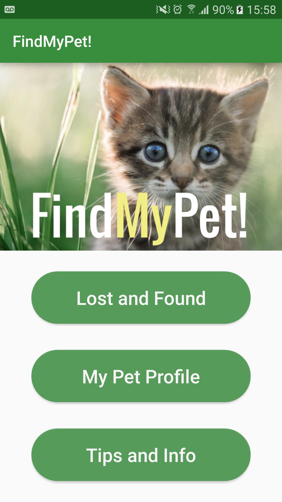
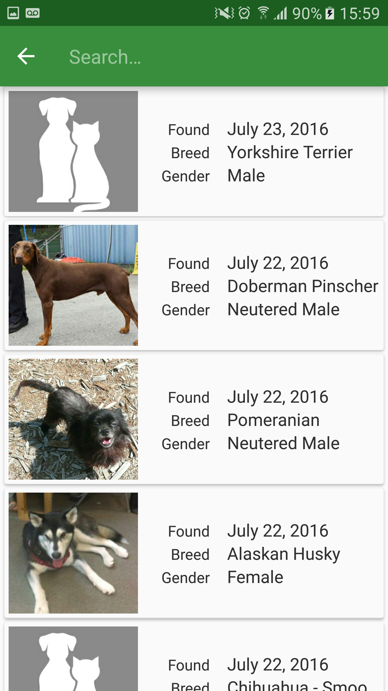
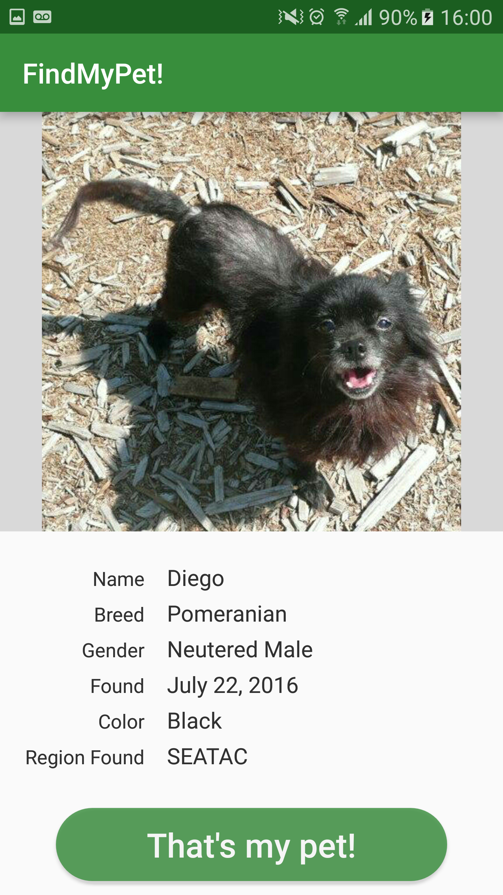

#FindMyPet!

##Contributors

[Matthew Duffin] (https://duffin22.github.io/) - Android Developer

[Severin Rudie] (https://www.linkedin.com/in/severin-rudie) - Android Developer

[Michael M Kang] (michaelmkang.com) - Android Developer

[Brian Sasville] (https://www.linkedin.com/in/bpsasville) - UX Designer

[Diana Artalejo] (https://www.linkedin.com/in/deartalejo) - UX Designer

[Jillian Ryan] (https://www.linkedin.com/in/jilianryan) - UX Designer

##Introduction

###Section 1
#######
Details.
